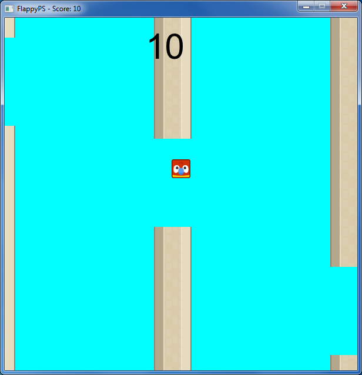

# FlappyPS

*If it's stupid, and it works, it's still stupid.* -???

Flappy Bird proof of concept in Powershell and SFML.NET.

Must be executed in x86 Powershell mode.

Sprites by [Kenney Vleugels](http://kenney.nl)

Controls:
* **Space** or **Mouse Buttons** to flap
* **Escape** to exit

